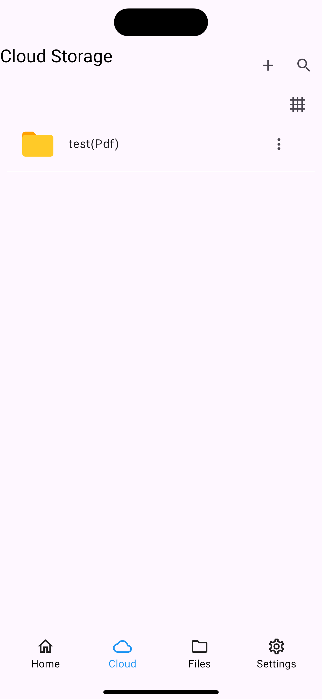
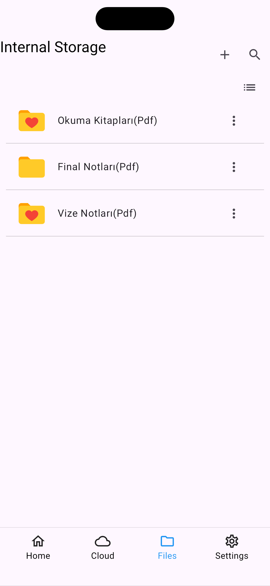
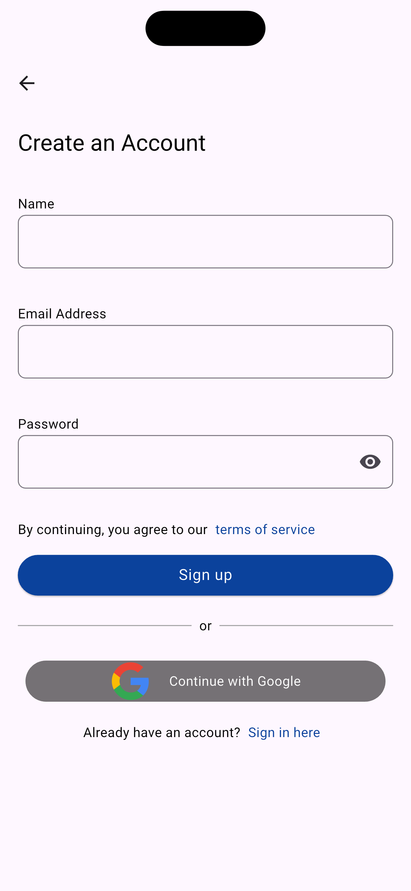

# 📌 Folder Pro

## 🚀 Comment
FolderPro is a file manager application that allows users to categorize, organize, share their files.

## 🚀 Features

✅ **File Management** – Pick, organize, and share files  
✅ **State Management** – Uses BLoC pattern for better structure  
✅ **Cloud & Local Storage** – Firebase + Hive integration  
✅ **Secure File Encryption** – Uses AES encryption with `encrypt` package  
✅ **Multi-language Support** – Integrated with `easy_localization`  
✅ **Navigation & Dependency Injection** – Uses `auto_route` and `get_it` 

## 📷 Screenshots

  
  

  
  

 
  
  

  
  

    

