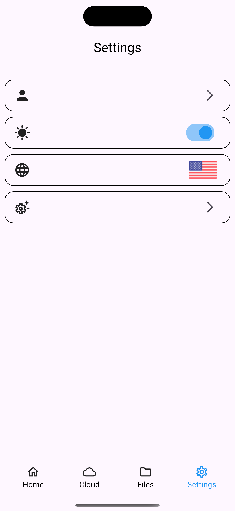

# 📌 Folder Pro

## 🚀 Comment
FolderPro is a file manager application that allows users to categorize, organize, share their files.

## 📷 Screenshots
<p align="center">
  
  
</p>

<p align="center">
  
  
</p>

<p align="center">
  
  
</p>

## 🔧 Setup
```sh
flutter pub get
flutter run
